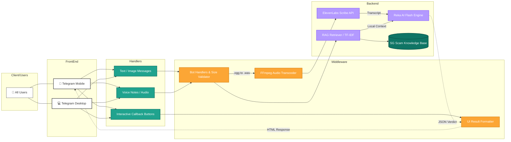

# 🛡️ FraudNot


**FraudNot** is an autonomous, multimodal Telegram bot designed to protect Singapore residents from digital fraud in real time. FraudNot analyse text messages, screenshots, and voice notes, providing a verdict with an explanation of its analysis 
based on its analysis. The analysis is grounded on the RAG database with actual Singapore scam cases rather than generic patterns.


---

## 📖 Table of Contents
1. [The Problem](#-the-problem)
2. [Key Features](#-key-features)
3. [System Architecture](#-system-architecture)
4. [Tech Stack](#-tech-stack)
5. [Getting Started (Local & Docker)](#-getting-started)
6. [Usage & Commands](#-usage--commands)
7. [Project Structure](#-project-structure)

---

## The Problem
Scams are Singapore's most prevalent crime. According to the **SPF Annual Scams and Cybercrime Brief 2025**, there were **37,308 scam cases** last year, with losses totalling **$913.1 million** — and that's only what was reported.

The four categories that do the most damage, per [ScamShield](https://www.scamshield.gov.sg):

| Scam Type | Losses |
|---|---|
| Investment Scams | **$336.2 million** |
| Government Impersonation | **$242.9 million** |
| Job Scams | **$123.5 million** |
| Phishing | **$39.9 million** |

The count went down 27.6% in 2025, but the tactics got harder to catch. Scammers now use AI-generated voice notes, deepfake images, and spoofed government sender IDs. Static keyword filters and URL blacklists weren't built for any of that.

The gap is modality. Existing tools can't read a screenshot of a fake PayNow transfer, can't listen to a cloned SPF officer's voice, and don't know that "safe account" transfers are a government impersonation red flag specific to Singapore. FraudNot was built to fill that gap.

---

## How FraudNot Helps

Send FraudNot a suspicious message, image, or voice note. It runs them through a forensic analysis pipeline grounded in real Singapore scam cases and returns a verdict with confidence score, scam type, key indicators, and a recommended action 
all within Telegram.

It is capable of drafting a police report in the format that SPF expects. This improves user experience of lodging a police report.

For anything urgent, call the **24/7 ScamShield Helpline at 1799**.

---

## Key Features

- **Multimodal analysis**:
Text, images, and voice notes all go through the same pipeline. A fabricated bank transfer screenshot, a phishing URL buried in a message, a voice note impersonating an ICA officer.

- **Singapore-specific RAG**:
Before every analysis, a TF-IDF retriever searches a curated knowledge base of verified SPF scam cases and injects the most relevant ones into the model's context. This is what stops the model from giving generic answers to Singapore-specific scam patterns.

- **Self-reflection on ambiguous results**:
When the initial confidence score lands between 30% and 70%, FraudNot runs a second verification pass. The model re-examines each indicator, rates its strength, checks for false-positive triggers, and produces a revised verdict. If the two passes disagree, the result defaults to SUSPICIOUS for human review.

- **Police report drafting**:
`/report` parses the last scan result and drafts a structured police report. It's clearly labelled as a draft that needs verification before submission.

- **Audio transcription pipeline**:
Telegram sends voice notes as OGG/Opus. FraudNot transcodes them to 16kHz mono WAV via FFmpeg, sends them to ElevenLabs Scribe for transcription, then runs the transcript through the standard text analysis pipeline. Voice-based impersonation scams get the same treatment as everything else.


---

## System Architecture


## Logic Flow
```
[ User ] 📱
    │
    ▼
[ Telegram Bot ] 🤖 ──────────────────────┐
    │                                      │ /report
    ├─► Text / Image                       │
    └─► Voice note (.ogg / .mp3 / etc.)    │
              │                            │
              ▼                            │
       [ FFmpeg + ElevenLabs ]             │
       (Transcode → Transcribe)            │
              │                            │
              ▼                            ▼
┌────────────────────────────────────────────────┐
│             Intelligence Core                  │
│                                                │
│  1. RAG Retriever  — TF-IDF, SPF cases     │
│  2. Pass 1         — Reka Flash scan           │
│  3. Pass 2         — Verification (if 30–70%)  │
└────────────────────────────────────────────────┘
    │
    ▼
[ Formatter ] → HTML verdict + inline button
    │
    ▼
[ User receives result ]
```

**Escalation logic:**

```
Confidence ≥ 71% or ≤ 29%  →  Return Pass 1 immediately
Confidence 30–70%           →  Run verification pass
  Both passes agree          →  Return higher-confidence result
  Passes disagree            →  Return SUSPICIOUS (55%), flag for review
```

---
## Tech Stack

| Layer | Technology |
|---|---|
| Language | Python 3.11+ |
| Bot Framework | python-telegram-bot v22.7 |
| AI / Vision | Reka Flash via HTTPX |
| Transcription | ElevenLabs Scribe (`scribe_v1`) |
| RAG Engine | scikit-learn (TF-IDF), NumPy |
| Audio Processing | pydub, FFmpeg |
| Infrastructure | Docker, Docker Compose |

---

## Getting Started

### Prerequisites

- A Telegram Bot Token — obtain from [@BotFather](https://t.me/BotFather)
- A [Reka AI](https://reka.ai) API key
- An [ElevenLabs](https://elevenlabs.io) API key (for voice transcription)
- Docker **or** Python 3.11+ with FFmpeg installed locally

---

### Option 1: Docker (Recommended)

Docker handles all system dependencies including FFmpeg automatically.

```bash
# 1. Clone the repository
git clone https://github.com/yourusername/SPOT-scambot.git
cd SPOT-scambot

# 2. Configure environment variables
cp .env.template .env
# Edit .env and fill in your keys

# 3. Build and run
docker-compose up -d --build

# 4. View live logs
docker-compose logs -f
```

---

### Option 2: Local Setup

**Step 1 — Install FFmpeg**

Ensure `ffmpeg` is installed and available on your system PATH:
- **Windows:** Download from [ffmpeg.org](https://ffmpeg.org/download.html) and add the `bin/` directory to PATH
- **macOS:** `brew install ffmpeg`
- **Linux:** `sudo apt install ffmpeg`

Verify: `ffmpeg -version`

**Step 2 — Configure environment**

```bash
cp .env.template .env
```

Edit `.env`:
```env
TELEGRAM_BOT_TOKEN="your-telegram-bot-token"
REKA_API_KEY="your-reka-api-key"
REKA_API_URL="https://api.reka.ai/v1"
ELEVENLABS_API_KEY="your-elevenlabs-api-key"
```

**Step 3 — Install dependencies and run**

```bash
python -m venv venv
source venv/bin/activate       # Windows: venv\Scripts\activate
pip install -r requirements.txt
python main.py
```

---

## Usage & Commands

| Command / Input | Action |
|---|---|
| `/start` | Welcome message and quick guide |
| `/help` | Full command reference |
| `/report` | Draft a police report from the last scan |
| Send any **text or URL** | Analyse for scam patterns |
| Send an **image / screenshot** | Analyse for visual scam indicators |
| Send a **voice note or audio file** | Transcribe and analyse for impersonation cues |

After every scan, an inline **"Draft a Police Report"** button appears for one-tap report generation.

---

## Project Structure
```
FraudNot/
├── Dockerfile                   # Debian-based image with FFmpeg
├── docker-compose.yml           # Container orchestration
├── main.py                      # Entry point and handler registration
├── requirements.txt
├── .env.template                # Environment variable template
├── handlers/
│   ├── start.py                 # /start command
│   ├── help.py                  # /help command
│   ├── text.py                  # Text and URL messages
│   ├── image.py                 # Photo uploads
│   ├── voice.py                 # Voice notes and audio files
│   └── report.py                # /report command + inline button callback
└── services/
    ├── reka_client.py           # AI pipeline, escalation logic, report generation
    ├── audio_converter.py       # FFmpeg transcoding (OGG → 16kHz WAV)
    ├── utils/
    │   ├── formatter.py         # HTML verdict formatter
    │   └── formatter_button.py  # Verdict with inline keyboard
    └── rag/
        ├── knowledge_base.py    # Curated SPF/MAS scam case database
        └── retriever.py         # TF-IDF cosine similarity search
```

---

## ⚠️ Disclaimer

FraudNot is a decision-support tool, not a replacement for professional judgement. All verdicts should be verified independently. If you believe you have been scammed:

- Call the **24/7 ScamShield Helpline at 1799**
- Lodge a police report at [police.gov.sg](https://www.police.gov.sg/e-services/lodge-police-report)
- Contact your bank immediately to freeze transactions

---

*Built for Singapore 🇸🇬 · Powered by [Reka AI](https://reka.ai) · Scam data sourced from [ScamShield](https://www.scamshield.gov.sg) and [SPF](https://www.police.gov.sg)*

