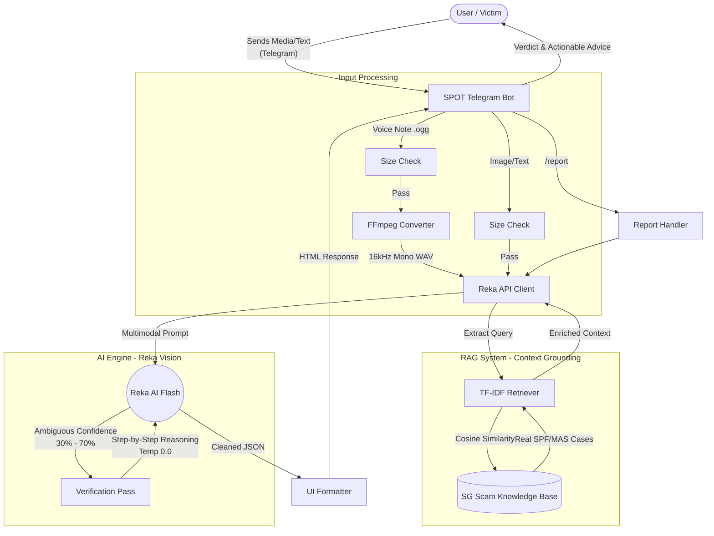

# 🛡️ SPOT (Scan Pattern Observation & Tracking)


**SPOT** is an autonomous, multimodal Telegram Bot designed to protect residents from modern digital fraud. It acts as a forensic scam detection engine capable of analyzing text messages, suspicious images, and cloned voice notes. 

Built with a focus on the Singaporean context, SPOT grounds its AI analysis in real-world advisories from the Singapore Police Force (SPF) and Monetary Authority of Singapore (MAS).

---

## 📖 Table of Contents
1. [The Problem](#-the-problem)
2. [Key Features](#-key-features)
3. [System Architecture](#-system-architecture)
4. [Tech Stack](#-tech-stack)
5. [Getting Started (Local & Docker)](#-getting-started)
6. [Usage & Commands](#-usage--commands)
7. [Project Structure](#-project-structure)
8. [Future Roadmap](#-future-roadmap)

---

## The Problem
Scams are becoming increasingly sophisticated. Threat actors now utilize AI-generated deepfakes, cloned voice notes, and highly targeted phishing campaigns. Traditional scam filters—which rely purely on static text-matching or blacklisted URLs—fail to catch multimodal threats (e.g., a voice note impersonating an official, or a screenshot of a fabricated bank transfer). 

**SPOT** solves this by offering a zero-friction, multimodal verification layer right inside Telegram.

---

## Key Features

* **Multimodal Threat Detection:** Powered by Reka AI, SPOT doesn't just read text. It "sees" screenshots of fake crypto platforms and "listens" to voice notes to detect impersonation and urgency cues.
* **Contextual RAG Pipeline:** Generic LLMs often miss local nuances. SPOT utilizes a custom Retrieval-Augmented Generation (RAG) system built with `scikit-learn` (TF-IDF). It intercepts queries, searches a curated database of verified Singaporean scam cases, and grounds the AI's analysis in local reality.
* **Self-Reflection & Verification Pass:** To eliminate false positives, SPOT features an autonomous escalation loop. If the AI's initial confidence score is ambiguous (30%–70%), the backend forces the model to act as a "Senior Forensic Investigator," re-evaluating the evidence step-by-step before returning a final verdict.
* **Automated Police Reporting:** If a user is targeted by a scam, SPOT lowers the friction of reporting it. By typing `/report`, the bot parses the forensic JSON from the last scan and drafts a formal, structured police report ready for submission to the authorities.
* **On-the-Fly Audio Transcoding:** Telegram voice notes (OGG/Opus) are automatically transcoded via FFmpeg into 16kHz WAV files, ensuring compatibility with the AI engine without hitting file size limits.

---

## System Architecture

## System Architecture



## How It Works:
The telegram bot uses REKA API to analyse the image. The bot returns a confidence scoring of the scam as well as the explainment based on its verdict.
It is capable of drafting a detailed explaination for submission, providing detailed information such as "" <<< which are useful information for the
police>>>

## Architecture:
```text
Scambot/
├── Dockerfile                  # Debian-based Dockerfile with FFmpeg
├── docker-compose.yml          # Container orchestration
├── main.py                     # Entry point & bot routing
├── requirements.txt
├── handlers/                   # Telegram event handlers
│   ├── image.py                # Handles photo uploads
│   ├── voice.py                # Handles audio/voice notes
│   ├── text.py                 # Handles text/links
│   ├── report.py               # Generates draft police reports
│   └── ...
└── services/                   # Core business logic
    ├── reka_client.py          # AI integration & Self-Reflection logic
    ├── audio_converter.py      # Transcodes Telegram OGG to WAV
    ├── utils/formatter.py      # HTML formatting for Telegram UI
    └── rag/
        ├── knowledge_base.py   # Curated SG scam patterns & indicators
        └── retriever.py        # TF-IDF search engine
```
## Tech Stack:
- Backend: Python 3.11+
- Frontend: 
- AI: Reka Vision


